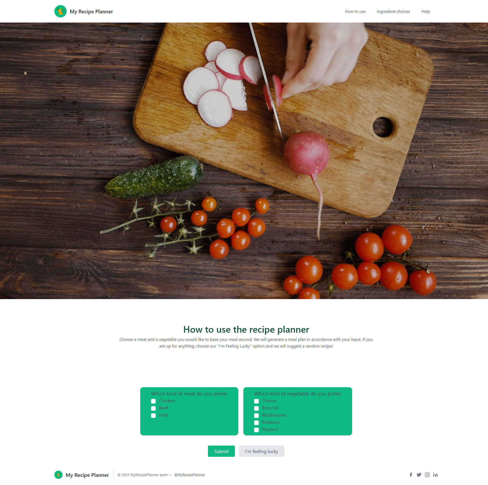
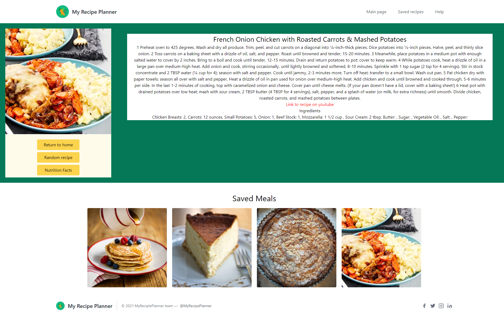
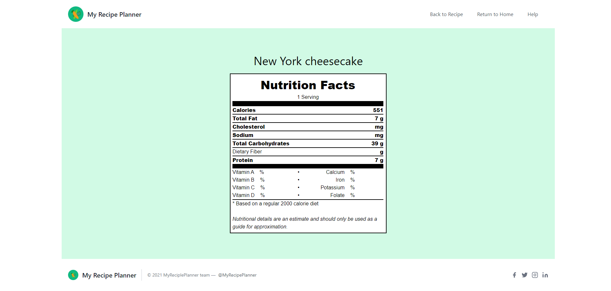

# My Recipe Planner

The goal of this project was to create a multi-page website that used 2 apis to retrieve and display information. We chose to make a website that would allow a user to find a recipe idea as well as the nutrition facts.

## About

This application allows the user to search for a meal based on their preference of meat and vegetable. The user may elect to generate a meal suggestion tailored to their input or generate a random suggestion if they prefer. Once an option is chosen, the user will be shown a meal along with its ingredients and how to prepare it. If the user is interested, they may find the nutrition facts about the meal, choose a random recipe, or return to the home screen to begin again.

## Notes

Some functionality that was originally intended to be added from the beginning of the project was removed due to limitations of the chosen api. The api we chose was the cheapest option to deliver recipe information which also made it difficult to break down specific requests. In future updates, we would like to add more options to meat and vegetable inputs, as well as adding an "Allergy" section where users could input any allergies they may have to filter out search results accordingly. 

## Screenshot

The following image shows the web application's appearance:

## Link to working application:

[Link to live application](https://PhilipBrowning.github.io/project1)

[Link to Github Repository](https://github.com/PhilipBrowning/project1)